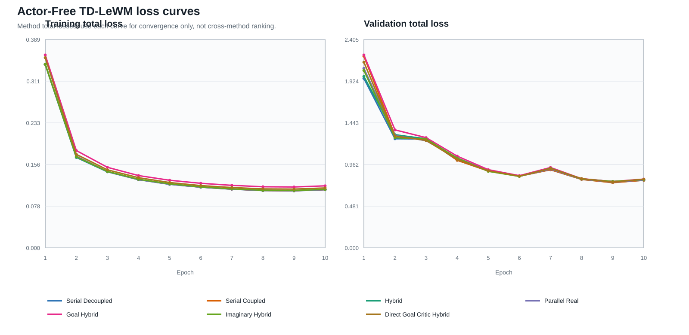

# Actor-Free TD-LeWM Cube O50：7×3 推理分数消融

本报告由完整服务器结果包自动生成。归档器已核验 7 个训练方法、每个方法 3 种
推理分数，共 21 个正式 O50；所有运行使用同一组 50 个 start--goal pair。排名只使用
combined 列：Successor 方法为 `f_plus_g`，Direct Goal Critic 为 `f_plus_c`。

## Combined 排名

| 排名 | 方法 | Combined | 成功数 | Success rate | 耗时（秒） |
| ---: | --- | --- | ---: | ---: | ---: |
| 1 | Hybrid (`hybrid`) | `f_plus_g` | 27/50 | 54% | 874.56 |
| 2 | Serial Decoupled (`serial_decoupled`) | `f_plus_g` | 23/50 | 46% | 992.89 |
| 2 | Imaginary Hybrid (`imaginary_hybrid`) | `f_plus_g` | 23/50 | 46% | 989.20 |
| 4 | Parallel Real (`parallel_real`) | `f_plus_g` | 22/50 | 44% | 1040.37 |
| 5 | Serial Coupled (`serial_coupled`) | `f_plus_g` | 20/50 | 40% | 1075.85 |
| 6 | Goal Hybrid (`goal_hybrid`) | `f_plus_g` | 19/50 | 38% | 1136.47 |
| 6 | Direct Goal Critic Hybrid (`direct_goal_hybrid`) | `f_plus_c` | 19/50 | 38% | 1127.35 |

## 三种推理分数

`F-only` 让 LeWM 对 H 个预测状态全部计分；`G/C-only` 仍运行 LeWM 来形成 tail
上下文，但候选排序不加入 F cost；combined 使用 F 与对应 tail 的和。

| 方法 | F-only | G/C-only | Combined |
| --- | ---: | ---: | ---: |
| Serial Decoupled (`serial_decoupled`) | 20/50 (40%) | 15/50 (30%) | 23/50 (46%) |
| Serial Coupled (`serial_coupled`) | 26/50 (52%) | 14/50 (28%) | 20/50 (40%) |
| Hybrid (`hybrid`) | 25/50 (50%) | 13/50 (26%) | 27/50 (54%) |
| Parallel Real (`parallel_real`) | 17/50 (34%) | 13/50 (26%) | 22/50 (44%) |
| Goal Hybrid (`goal_hybrid`) | 25/50 (50%) | 19/50 (38%) | 19/50 (38%) |
| Imaginary Hybrid (`imaginary_hybrid`) | 24/50 (48%) | 13/50 (26%) | 23/50 (46%) |
| Direct Goal Critic Hybrid (`direct_goal_hybrid`) | 22/50 (44%) | 16/50 (32%) | 19/50 (38%) |

## 方法、网络、损失与推理

所有方法共享 LeWM encoder/predictor、Cube 数据、10 epochs / 127,960 updates、
training seed 3072，以及无 Actor 的 CEM-MPC。`L_LeWM` 包含 prediction MSE 与
0.09 倍 SIGReg；辅助 TD 在训练前 5% updates 线性 warm-up。

| 方法 | 网络结构 | 训练损失 | 特殊设计 | 推理 |
| --- | --- | --- | --- | --- |
| Serial Decoupled (`serial_decoupled`) | LeWM + one successor-feature head on predicted latent history | L_LeWM + alpha_u L_TD^pred | Predicted context is detached; TD updates the successor head only. | CEM with F-only, G-only, or F+G cost. |
| Serial Coupled (`serial_coupled`) | LeWM + one successor-feature head on predicted latent history | L_LeWM + alpha_u L_TD^pred | Predicted context stays differentiable; TD also reaches LeWM. | CEM with F-only, G-only, or F+G cost. |
| Hybrid (`hybrid`) | LeWM + one shared successor head for real and predicted histories | L_LeWM + alpha_u (L_TD^real + L_TD^pred) | The same head is trained on parallel-real and coupled-serial branches. | CEM with F-only, G-only, or F+G cost. |
| Parallel Real (`parallel_real`) | LeWM predictor and successor head are parallel on encoder latents | L_LeWM + alpha_u L_TD^real | TD uses real latent history and does not pass through the predictor. | CEM with F-only, G-only, or F+G cost. |
| Goal Hybrid (`goal_hybrid`) | Hybrid successor head with fixed linear goal readout G^T w(g) | L_LeWM + alpha_u (L_SF-TD^real + L_SF-TD^pred + L_goal-TD^real + L_goal-TD^pred) | Goal readout is trained by hindsight goal-conditioned Bellman TD. | CEM with F-only, G-only, or F+G cost. |
| Imaginary Hybrid (`imaginary_hybrid`) | Hybrid successor head with an EMA-LeWM imagined bootstrap state | L_LeWM + alpha_u (L_TD^real + L_TD^pred) | The TD target bootstraps one step through the stopped EMA predictor. | CEM with F-only, G-only, or F+G cost. |
| Direct Goal Critic Hybrid (`direct_goal_hybrid`) | LeWM + one scalar goal-conditioned critic for real/predicted histories | L_LeWM + alpha_u (L_C-TD^real + L_C-TD^pred) | Goal latent enters the critic directly; there is no SF factorization. | CEM with F-only, C-only, or F+C cost. |

## 训练摘要与 checkpoint 来源

**重要：不同方法加入的辅助 loss 数量与定义不同，因此图中的 total loss 只能
用于检查各自是否收敛，不能比较曲线高低，也不能当作跨方法性能排名。**

| 方法 | Epoch-10 train/loss | Epoch-10 validation/loss | Best validation | Checkpoint SHA-256 | Training commit |
| --- | ---: | ---: | ---: | --- | --- |
| Serial Decoupled | 0.108424 | 0.780097 | 0.754505 (E9) | `cb8be3f9a851…` | `8e667cb6a8e9` |
| Serial Coupled | 0.108643 | 0.780158 | 0.752397 (E9) | `2fe3fd5bcb2c…` | `8e667cb6a8e9` |
| Hybrid | 0.108973 | 0.784110 | 0.766112 (E9) | `299222acff78…` | `8e667cb6a8e9` |
| Parallel Real | 0.108762 | 0.784254 | 0.757853 (E9) | `61b5614a7b92…` | `e895637d8c7e` |
| Goal Hybrid | 0.115752 | 0.793633 | 0.766048 (E9) | `a746912bddd0…` | `88ad2ec12c1d` |
| Imaginary Hybrid | 0.109176 | 0.788777 | 0.766026 (E9) | `e7656fed92a0…` | `ea82e8f2984f` |
| Direct Goal Critic Hybrid | 0.111773 | 0.792399 | 0.759004 (E9) | `b3345e9eefdb…` | `a1d98a2d0881` |

## 审计结论与边界

- 21 个运行的 selection 文件 SHA-256：`e46ea81cce2e6a9a5df05ba04893b4181cbd8979340111a012c30f1efa2d7ee7`。
- 七个训练 manifest 的完整 protocol 分别与对应锁定 YAML 的 canonical hash 一致；split 样本数和索引哈希一致，run-specific 绝对路径不参与指纹。
- 每个方法的三种 score mode 使用完全相同的 checkpoint；其路径严格对应训练器的 epoch-10 export。
- 21 个运行共享完整正式协议、关键 runtime、数据格式/大小/转换来源、action normalization 与 world 参数量指纹。
- 所有运行均为 50 episodes、goal offset 50、planning seed 42、完整 CEM 预算，
  且 `smoke=false`、`pilot=false`。
- 每个 success rate 都已由 50 个逐 episode 布尔值重新计算并核对。
- 这仍然只是一个 training seed 和一个 planning selection。它适合结构/推理消融，
  不足以支持跨训练 seed 的总体优越性声明。

机器可读摘要、50×21 配对结果和来源哈希见
[`artifacts/actor_free_td_lewm_cube_seed3072/`](artifacts/actor_free_td_lewm_cube_seed3072/README.md)。
