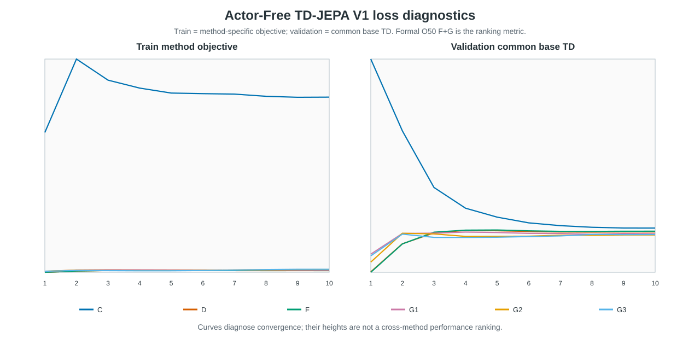

# Results TD — Actor-Free TD-JEPA V1 Cube O50

本报告由 6 个训练产物与 18 个正式 O50 evaluator 原始输出自动生成。
排名只使用预先定义的 **F+G**，不从三种推理评分中事后取最好值。

## 正式结果

| Rank | Method | F-only | G-only | F+G | Δ F+G − F-only |
| ---: | --- | ---: | ---: | ---: | ---: |
| 5 | V1-C Goal-Projected TD | 46% (23/50) | 36% (18/50) | 44% (22/50) | -2 pp |
| 6 | V1-D Goal-Value Weighted TD | 46% (23/50) | 44% (22/50) | 42% (21/50) | -4 pp |
| 3 | V1-F Same-Future / Different-Goal Advantage | 46% (23/50) | 46% (23/50) | 48% (24/50) | +2 pp |
| 3 | V1-G1 Neighbor Action Advantage | 46% (23/50) | 42% (21/50) | 48% (24/50) | +2 pp |
| 2 | V1-G2 Prefix-Mean Advantage | 46% (23/50) | 42% (21/50) | 50% (25/50) | +4 pp |
| 1 | V1-G3 Prefix-Marginal Advantage | 46% (23/50) | 38% (19/50) | 54% (27/50) | +8 pp |

## 方法、网络、损失与推理

所有方法共享 **frozen LeWM** 和同一个 frozen shared LeWM action encoder。训练只更新一个 379,072 参数的 goal-conditioned TD-JEPA predictor；没有 Actor、没有 reward loss，也没有 LeWM reconstruction/prediction loss。

共同 feature TD target 为 `s_next + gamma * (1-terminal) * EMA-G(s_next, E_A(a_next), task)`；数据集 next action 经冻结的 25D→192D LeWM action encoder 后参与 bootstrap。

| Method | Network | Training loss | Special mechanism | Inference |
| --- | --- | --- | --- | --- |
| V1-C Goal-Projected TD | Frozen LeWM + frozen shared action encoder + one 379,072-parameter TD-JEPA predictor | Common feature TD plus goal-projected TD residual on goal-derived tasks | Directly constrains the detached TD target and prediction after projection onto the matched goal | F-only horizon 5; G-only horizon 1; F+G horizon 5 |
| V1-D Goal-Value Weighted TD | Frozen LeWM + frozen shared action encoder + one 379,072-parameter TD-JEPA predictor | Detached target-goal scores reweight the common real-transition feature TD | Goal-subset softmax weights; random-task weight remains one; final weights have mean one | F-only horizon 5; G-only horizon 1; F+G horizon 5 |
| V1-F Same-Future / Different-Goal Advantage | Frozen LeWM + frozen shared action encoder + one 379,072-parameter TD-JEPA predictor | Same-future/different-goal detached advantage reweights common feature TD | Matching task score is contrasted with all goal-derived tasks in the batch | F-only horizon 5; G-only horizon 1; F+G horizon 5 |
| V1-G1 Neighbor Action Advantage | Frozen LeWM + frozen shared action encoder + one 379,072-parameter TD-JEPA predictor | Neighbor-action detached advantage reweights common real-action feature TD | Other-episode KNN actions are comparison-only and never create candidate TD targets | F-only horizon 5; G-only horizon 1; F+G horizon 5 |
| V1-G2 Prefix-Mean Advantage | Frozen LeWM + frozen shared action encoder + one 379,072-parameter TD-JEPA predictor | Full-prefix score minus mean prefix score reweights common feature TD | Zero-mean suffix prefixes are comparison-only; the real full action supplies the TD pair | F-only horizon 5; G-only horizon 1; F+G horizon 5 |
| V1-G3 Prefix-Marginal Advantage | Frozen LeWM + frozen shared action encoder + one 379,072-parameter TD-JEPA predictor | Mean adjacent prefix-score improvement reweights common feature TD | Prefix marginal gains are detached comparison signals, not extra TD targets | F-only horizon 5; G-only horizon 1; F+G horizon 5 |

## Loss 曲线语义

`train/loss` 是每个方法自己的训练 objective；`validation/loss` 对六个方法统一为 common base TD。训练曲线定义不同，不能按高低做跨方法排名；正式 O50 F+G 才是本表排名依据。

| Method | Epoch-10 train method loss | Epoch-10 train base TD | Epoch-10 validation base TD | Best validation | Checkpoint SHA-256 |
| --- | ---: | ---: | ---: | ---: | --- |
| V1-C Goal-Projected TD | 25927.304688 | 1071.673706 | 959.264771 | 959.264771 (E10) | `88bd65c48a6c…` |
| V1-D Goal-Value Weighted TD | 531.178040 | 906.090637 | 923.234558 | 546.340820 (E1) | `3115fffeb83b…` |
| V1-F Same-Future / Different-Goal Advantage | 533.615112 | 913.841187 | 929.770752 | 541.974182 (E1) | `b4de1b511075…` |
| V1-G1 Neighbor Action Advantage | 604.266785 | 881.119324 | 905.668335 | 713.089966 (E1) | `c224d18fcd83…` |
| V1-G2 Prefix-Mean Advantage | 688.672546 | 872.857605 | 894.454529 | 638.226624 (E1) | `1c290f91772b…` |
| V1-G3 Prefix-Marginal Advantage | 722.493347 | 874.674683 | 897.862122 | 697.314941 (E1) | `b279a85b1dd0…` |

## 审计结论与边界

- 18 个运行共享固定 selection SHA-256：`e46ea81cce2e6a9a5df05ba04893b4181cbd8979340111a012c30f1efa2d7ee7`。
- score-mode horizon 锁为 F-only=5、G-only=1、F+G=5；其余正式 CEM 参数一致。
- frozen shared action encoder canonical state hash：`2657b55140013b4b071cd8cdea63f1eac5c65c498d55331c7499744ef31a9cd3`。
- 每个方法的三种 score mode 使用同一 epoch-10 checkpoint；success rate 均由 50 个逐 episode 布尔值重算。
- 只有一个 training seed 和一组 planning selection；结果适合作为结构消融，不能声称多随机种子总体最优。
- 当前 V1 trainer 未记录 `peak_cuda_memory_bytes` 与/或 `runtime.cuda_device` （c, d, f, g1, g2, g3）。归档未补造；缺失项明确标为 `not_recorded_by_v1_trainer`，GPU/PID/命令/日志来源来自独立 execution evidence。
- Training acceptance warning: c.process: PID 122116 was reaped without an exit marker
- Training acceptance warning: d.process: PID 122117 was reaped without an exit marker
- Training acceptance warning: f.process: PID 122118 was reaped without an exit marker
- Training acceptance warning: g1.process: PID 122119 was reaped without an exit marker
- Training acceptance warning: g2.process: PID 122120 was reaped without an exit marker
- Training acceptance warning: g3.process: PID 122121 was reaped without an exit marker
