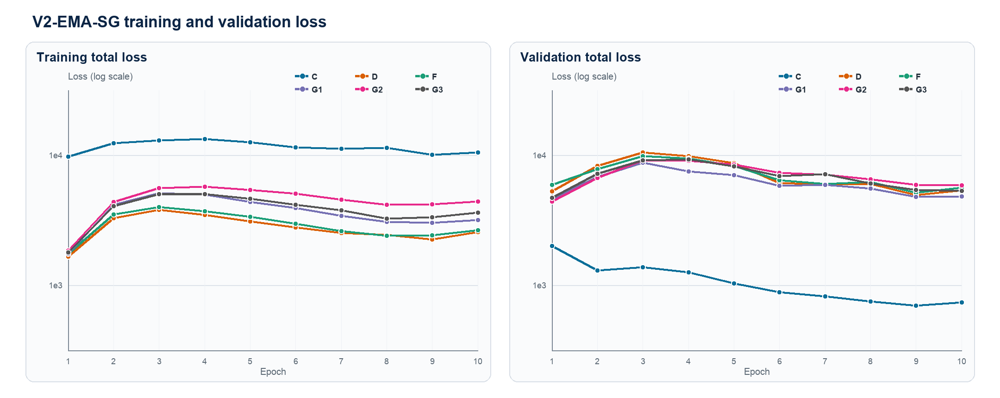
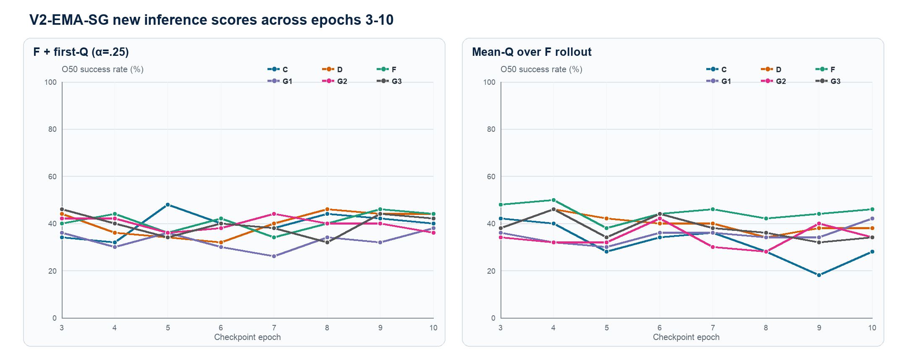

# Results TD — V2-EMA-SG 新推理评分（Cube seed 3072）

本报告只接受严格归档后的 **96 个 V2-EMA checkpoint×评分单元**和 **24 个固定 V0/V1/V2 checkpoint 单元**。所有结果均为 O50；每格 50 个 start-goal pair。模型没有 Actor，也没有 reward loss。

## 网络、TD target 与总训练损失

在线 LeWM 产生真实 latent `z_t=E_θ(o_t)` 和可微预测 latent `ẑ_t=F_θ(H_{t-1},E^A_θ(a_{t-1}))`；同一个 TD-JEPA predictor `G_φ` 分别接收两条支路：

$$s_t^{real}=z_t,\qquad s_t^{pred}=\hat z_t.$$

两条支路共享一个完全 stop-gradient 的 EMA target：

$$Y_t=\operatorname{sg}\left[\bar z_{t+1}+\gamma(1-d_t)G_{\bar\phi}(\bar z_{t+1},\bar e_{t+1},m_t)\right],\qquad \gamma=0.95.$$

其中 `z̄_{t+1}=E_{θ̄}(o_{t+1})` 来自真实下一帧的 EMA encoder，`ē_{t+1}=E^A_{θ̄}(a_{t+1})` 来自数据集已知 next action。它们不是 online LeWM 想象出来的下一状态/动作。基础 TD 误差为：

$$\ell_{t,b}^{TD}=\left\|G_\phi(s_t^b,e_t,m_t)-Y_t\right\|_2^2,\qquad b\in\{real,pred\}.$$

V2-EMA-SG 的 LeWM 一步预测本身也改用真实下一帧经过 EMA encoder 的 latent 作为 stop-gradient target：

$$L_{pred}=\operatorname{MSE}(F_\theta(H_t,e_t),\operatorname{sg}(\bar z_{t+1})).$$

完整训练目标是：

$$L_{total}=L_{pred}+0.09L_{SIGReg}+\rho(u)\left(L_{method}^{real}+L_{method}^{pred}\right),$$

`ρ(u)` 在前 5% optimizer updates 从 0 线性升到 1。predicted-state 支路不 detach，因此 TD 梯度会回传到 online LeWM predictor 和共享 Action Encoder；EMA world model 与 EMA `G` 只生成 target。validation 使用共同的、未加方法特定权重的 base Hybrid TD，因此 total loss 高低不能直接跨方法排序。

目标任务子集的统一权重为 `w_i=N_g softmax(A_i/τ)`（`τ=0.5`，stop-gradient，随机任务权重固定为 1，最后全 batch 均值归一为 1）。六个方法只改变下面的特殊信号/额外项：

| 方法 | 特殊信号 | 每条 real/pred 支路的 loss | 作用 |
| --- | --- | --- | --- |
| C | `q_i^b = G_phi(s_i^b,e_i,m_i)^T m_i; q_i^Y = Y_i^T m_i` | `L_C^b = mean(l_i^b) + lambda_C mean_goal[(q_i^b-q_i^Y)^2], lambda_C=1` | Only C adds a trainable scalar projection residual on goal-derived tasks. |
| D | `A_i = sg(Y_i^T m_i)` | `L_D^b = mean_i[w_i(A) l_i^b]` | Detached target goal value reweights TD; tau=0.5. |
| F | `A_i = sg[Y_i^T m_i - mean_j(Y_i^T m_j)]` | `L_F^b = mean_i[w_i(A) l_i^b]` | Matched future/task is contrasted with all goal tasks in the batch. |
| G1 | `A_i = sg[q_i - sum_k softmax(-d_ik/tau_n) q_ik]` | `L_G1^b = mean_i[w_i(A) l_i^b]` | K=8 other-episode latent-neighbour actions; candidates have no TD targets. |
| G2 | `A_i = sg[q_i5 - (1/5) sum_{j=1}^5 q_ij]` | `L_G2^b = mean_i[w_i(A) l_i^b]` | Five zero-suffix action prefixes; full-minus-prefix-mean signal. |
| G3 | `A_i = sg[(1/4) sum_{j=1}^4(q_i,j+1-q_ij)]` | `L_G3^b = mean_i[w_i(A) l_i^b]` | Five prefixes; mean adjacent marginal score gain. |

## 两个新增推理评分

令 `w(g)` 为 goal latent 归一化后的任务向量，`Q_G(z,A,g)=G(z,E^A(A),w(g))^T w(g)`。CEM 仍然只负责搜索候选动作序列、最小化 cost、执行第一块动作并重新规划；这里没有训练 Actor。

### 1. F + first-Q（`f_plus_g_first`）

$$J_{first}(A_{1:5})=\|\hat z_5-z_g\|_2^2-0.25\,Q_G(z_0,A_1,g).$$

F 完整 rollout 五个 action blocks；`Q_G` 只评价当前真实 online latent `z_0` 与第一块候选动作 `A_1`。**没有 `γ^4` tail 折扣**。

### 2. F rollout 上的 Mean-Q（`g_only_f_rollout_mean`）

$$J_{mean}(A_{1:5})=-\frac{1}{5}\sum_{k=1}^{5}Q_G(z_{k-1}^{F},A_k,g),$$

其中 `z_0^F=z_0`，`z_1^F,…,z_4^F` 由 online LeWM 的完整 F rollout 产生。F 在这里仅生成 imagined states；不使用 terminal goal-distance，`γ` 也不参与评分。

## V2-EMA epoch 10：原三评分 + 两个新评分

这五列绑定同一组 epoch-10 checkpoint，并使用共享正式 episode selection `e46ea81c…`，可以作为同一 50 pair set 上的推理评分消融。

| 方法 | F-only | G-only | F+G tail | F + first-Q | Mean-Q rollout |
| --- | ---: | ---: | ---: | ---: | ---: |
| C | 12/50 (24%) | 18/50 (36%) | 12/50 (24%) | 20/50 (40%) | 14/50 (28%) |
| D | 15/50 (30%) | 19/50 (38%) | 16/50 (32%) | 22/50 (44%) | 19/50 (38%) |
| F | 15/50 (30%) | 19/50 (38%) | 17/50 (34%) | 22/50 (44%) | 23/50 (46%) |
| G1 | 15/50 (30%) | 15/50 (30%) | 11/50 (22%) | 19/50 (38%) | 21/50 (42%) |
| G2 | 12/50 (24%) | 20/50 (40%) | 16/50 (32%) | 18/50 (36%) | 17/50 (34%) |
| G3 | 12/50 (24%) | 17/50 (34%) | 13/50 (26%) | 21/50 (42%) | 17/50 (34%) |

## 固定 V0/V1/V2 checkpoint：完整 24 格

固定 checkpoint 表与 EMA sweep **使用同一个 episode-selection.json（`e46ea81c…`）**，因此可以在同一 O50 pair set 上比较成功率。`88c20477…` 只是 fixed launcher 的 canonical valid-row-ranks digest，不代表另一组 pair。当前报告输入没有逐格 outcome 向量，因此不做逐-pair 显著性检验。V0/V1 只支持 first-Q；Mean-Q rollout 是 V2-only。

| Version | 方法 | 评分 | O50 | Checkpoint SHA（短） |
| --- | --- | --- | ---: | --- |
| V0 | C | F + first-Q (α=.25) | 26/50 (52%) | 282098cb541a… |
| V0 | D | F + first-Q (α=.25) | 24/50 (48%) | fb5694c3c1fc… |
| V0 | F | F + first-Q (α=.25) | 24/50 (48%) | b1d2b343e214… |
| V0 | G1 | F + first-Q (α=.25) | 20/50 (40%) | 684b2fdf8eca… |
| V0 | G2 | F + first-Q (α=.25) | 23/50 (46%) | ffb35c215941… |
| V0 | G3 | F + first-Q (α=.25) | 24/50 (48%) | 8c71b1dca1f6… |
| V1 | C | F + first-Q (α=.25) | 28/50 (56%) | 88bd65c48a6c… |
| V1 | D | F + first-Q (α=.25) | 25/50 (50%) | 3115fffeb83b… |
| V1 | F | F + first-Q (α=.25) | 26/50 (52%) | b4de1b511075… |
| V1 | G1 | F + first-Q (α=.25) | 26/50 (52%) | c224d18fcd83… |
| V1 | G2 | F + first-Q (α=.25) | 25/50 (50%) | 1c290f91772b… |
| V1 | G3 | F + first-Q (α=.25) | 26/50 (52%) | b279a85b1dd0… |
| V2 | C | F + first-Q (α=.25) | 19/50 (38%) | 80d74a8c8271… |
| V2 | D | F + first-Q (α=.25) | 21/50 (42%) | 5be6d332127a… |
| V2 | F | F + first-Q (α=.25) | 21/50 (42%) | 41ac4830f190… |
| V2 | G1 | F + first-Q (α=.25) | 19/50 (38%) | 750e7fad3b2f… |
| V2 | G2 | F + first-Q (α=.25) | 20/50 (40%) | e7432f12aab1… |
| V2 | G3 | F + first-Q (α=.25) | 19/50 (38%) | 2ba15d66cb38… |
| V2 | C | Mean-Q over F rollout | 10/50 (20%) | 80d74a8c8271… |
| V2 | D | Mean-Q over F rollout | 24/50 (48%) | 5be6d332127a… |
| V2 | F | Mean-Q over F rollout | 22/50 (44%) | 41ac4830f190… |
| V2 | G1 | Mean-Q over F rollout | 17/50 (34%) | 750e7fad3b2f… |
| V2 | G2 | Mean-Q over F rollout | 13/50 (26%) | e7432f12aab1… |
| V2 | G3 | Mean-Q over F rollout | 17/50 (34%) | 2ba15d66cb38… |

## V2-EMA 每个方法×评分的最佳 epoch（事后分析）

> 下表是在 epoch 3–10 看完结果后事后选择 checkpoint，存在 selection bias。它只能用于理解训练轨迹和提出下一轮预注册 checkpoint 规则，不能当作无偏最终性能。正式 checkpoint 口径仍应单独报告 epoch 10。

| 方法 | 评分 | 最佳 epoch | 最佳 O50 | Epoch 10 | 最佳−E10 |
| --- | --- | --- | ---: | ---: | ---: |
| C | F + first-Q (α=.25) | E5 | 24/50 (48%) | 20/50 (40%) | +4/50 |
| C | Mean-Q over F rollout | E3 | 21/50 (42%) | 14/50 (28%) | +7/50 |
| D | F + first-Q (α=.25) | E8 | 23/50 (46%) | 22/50 (44%) | +1/50 |
| D | Mean-Q over F rollout | E4 | 23/50 (46%) | 19/50 (38%) | +4/50 |
| F | F + first-Q (α=.25) | E9 | 23/50 (46%) | 22/50 (44%) | +1/50 |
| F | Mean-Q over F rollout | E4 | 25/50 (50%) | 23/50 (46%) | +2/50 |
| G1 | F + first-Q (α=.25) | E10 | 19/50 (38%) | 19/50 (38%) | +0/50 |
| G1 | Mean-Q over F rollout | E10 | 21/50 (42%) | 21/50 (42%) | +0/50 |
| G2 | F + first-Q (α=.25) | E7 | 22/50 (44%) | 18/50 (36%) | +4/50 |
| G2 | Mean-Q over F rollout | E6 | 21/50 (42%) | 17/50 (34%) | +4/50 |
| G3 | F + first-Q (α=.25) | E3 | 23/50 (46%) | 21/50 (42%) | +2/50 |
| G3 | Mean-Q over F rollout | E4 | 23/50 (46%) | 17/50 (34%) | +6/50 |

## 曲线

训练 total loss 是方法特定目标；validation total loss 使用共同 base Hybrid TD，但仍包含 LeWM prediction/SIGReg。先看各方法自身的收敛趋势，不按绝对高度跨方法排名。

新评分曲线覆盖 epoch 3–10；每一个点都是同一 EMA 50-pair selection 的完整 O50。

## 关键结论与边界

- Epoch 10 的 `F + first-Q` 最好为 **D/F: 22/50 (44%)**；Mean-Q rollout 最好为 **F: 23/50 (46%)**。
- Epoch 10 六方法均值：first-Q **40.7%**，Mean-Q **37.0%**。固定 checkpoint 的 first-Q 均值为 V0 **47.0%**、V1 **52.0%**、V2 **39.7%**；因此这组固定对照中 V1 最强。
- 固定 V2 checkpoint 的 first-Q 表中最好为 **D/F: 21/50 (42%)**；它与 EMA 表使用相同 O50 pair set，可以比较成功率，但本报告不声称逐-pair 统计显著性。
- first-Q 只把 G 当作第一动作的 critic/readout；Mean-Q 则让 G 在 F rollout 的五个 predecessor-action 对上都参与排序。两者都不训练策略，也不会把 CEM 变成 Actor。
- C/D/F/G1/G2/G3 的差异发生在训练期 TD loss 或其 detached 权重；推理时六者使用同一评分公式，只是 checkpoint 内学到的 `G` 不同。
- 全部 120 格共享同一组 planning selection，但只有一个 training seed（3072）。96 格 epoch sweep 与最佳 epoch 表是结构/训练轨迹消融，不支持多随机种子总体最优或统计显著性结论。

## 审计信息

- Training commit: `18cd574d522515f20f4103509b1e660b2fc89ea6`
- Evaluation commit: `5456f3d18116812d078d4ec2e85ba1f83d89c7c7`
- Shared 120-cell episode-selection file SHA-256: `e46ea81cce2e6a9a5df05ba04893b4181cbd8979340111a012c30f1efa2d7ee7`
- Fixed-launcher canonical valid-row-ranks SHA-256: `88c204770f33c0b0220057d45b187766e3cfc54912e3f5ca49f2aa93d16437e9`
- Action-normalization SHA-256: `57f4d3c252e1805f4af1f614d20d1d1a064fa0d1d463ed5eb8ecf9dfc2b1a723`
- EMA grid: epochs 3–10 × C/D/F/G1/G2/G3 × 2 scores = 96；fixed grid: 18 first-Q + 6 V2 Mean-Q = 24。
